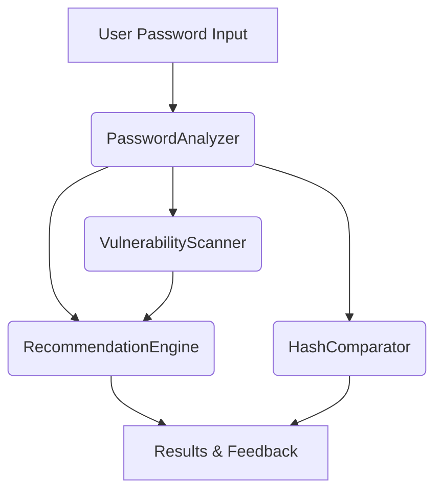

# Architecture Overview

This document explains the software architecture of the Cybersecurity & Password Security Analyzer project.

## Core Components
- **PasswordAnalyzer**: Calculates entropy, complexity, and analyses password strength.
- **HashComparator**: Compares multiple hashing algorithms and benchmarks them.
- **VulnerabilityScanner**: Checks passwords against common/weak password databases.
- **RecommendationEngine**: Generates feedback and recommendations for better password security.

## Workflow
1. **User Input**: Password is provided (web app/CLI).
2. **Analysis**: PasswordAnalyzer computes properties and strength.
3. **Vulnerability Scan**: Scanner checks against known weak credentials.
4. **Recommendations**: Engine aggregates analysis and scanner results for user feedback.
5. **Hashing**: HashComparator demonstrates and benchmarks various hash options.

## Data Flow

## Extensibility
- New password policies/data formats can be added in `data/`.
- Modular code in `src/` maximizes reusability across web/CLI.
- Future enhancements may add HaveIBeenPwned API, ML prediction, dashboard modules.
